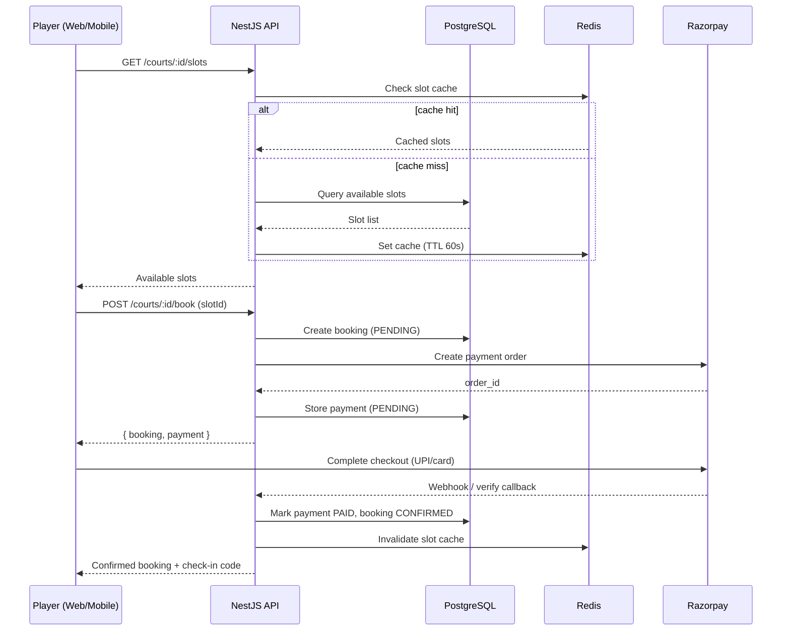
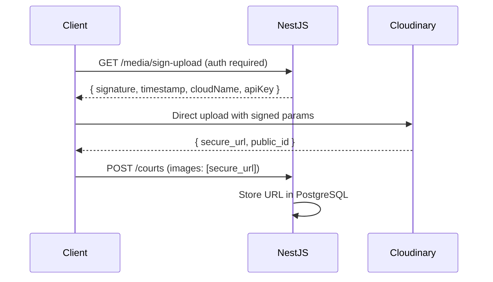
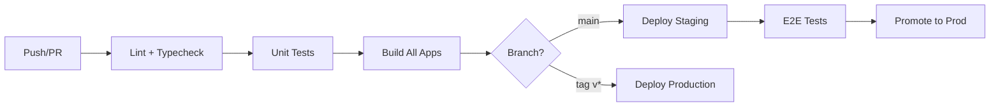

# FitOra — System Architecture

**Version:** 1.0  
**Status:** Approved  
**Last Updated:** July 5, 2026  
**Owner:** Engineering  

**Related:** [PRD](./PRD.md)

---

## Table of Contents

1. [Executive Summary](#1-executive-summary)
2. [Architecture Principles](#2-architecture-principles)
3. [High-Level System Diagram](#3-high-level-system-diagram)
4. [Frontend](#4-frontend)
5. [Backend](#5-backend)
6. [Database](#6-database)
7. [Authentication](#7-authentication)
8. [Authorization](#8-authorization)
9. [Caching](#9-caching)
10. [Storage](#10-storage)
11. [Notifications](#11-notifications)
12. [Payments](#12-payments)
13. [Logging](#13-logging)
14. [Monitoring](#14-monitoring)
15. [CI/CD](#15-cicd)
16. [Scalability](#16-scalability)
17. [Folder Structure](#17-folder-structure)
18. [Environment Strategy](#18-environment-strategy)
19. [Security Architecture](#19-security-architecture)
20. [Multi-Tenancy](#20-multi-tenancy)
21. [Evolution Roadmap](#21-evolution-roadmap)

---

## 1. Executive Summary

FitOra is a **multi-sided sports & fitness platform** serving six roles across ten product modules. The architecture follows a **modular monolith** pattern today, designed to evolve into **domain-oriented services** as scale demands.

### Technology Stack

| Layer | Technology | Purpose |
|-------|------------|---------|
| **Web (Player + Owner + Trainer)** | Next.js 15, React 19, Tailwind CSS 4 | Responsive web app, SEO landing, role dashboards |
| **Admin** | Next.js 15 | Internal operations dashboard |
| **Mobile** | React Native (Expo) | iOS/Android player & provider apps |
| **API** | NestJS 11 | REST API, business logic, integrations |
| **ORM** | Prisma 6 | Type-safe database access, migrations |
| **Primary DB** | PostgreSQL 16 | Transactional data, ACID guarantees |
| **Cache / Queue** | Redis 7 | Sessions, cache, rate limits, job queues |
| **Media** | Cloudinary | Image upload, transform, CDN delivery |
| **Push / Auth (Mobile)** | Firebase (FCM, optional Auth) | Push notifications, device tokens |
| **Payments** | Razorpay | UPI, cards, wallets — India-first |
| **Monorepo** | Turborepo + pnpm | Shared packages, unified builds |

### Deployment Topology (Production Target)

```
                    ┌─────────────────────────────────────────┐
                    │              CDN / Edge                  │
                    │   (Vercel / CloudFront + Cloudinary)    │
                    └───────────────┬─────────────────────────┘
                                    │
         ┌──────────────────────────┼──────────────────────────┐
         │                          │                          │
         ▼                          ▼                          ▼
  ┌─────────────┐           ┌─────────────┐           ┌─────────────┐
  │  Web App    │           │  Admin App  │           │ Mobile App  │
  │  (Next.js)  │           │  (Next.js)  │           │   (Expo)    │
  └──────┬──────┘           └──────┬──────┘           └──────┬──────┘
         │                         │                          │
         └─────────────────────────┼──────────────────────────┘
                                   │ HTTPS / REST
                                   ▼
                    ┌──────────────────────────────┐
                    │      API Gateway / LB         │
                    │   (nginx / ALB / Railway)     │
                    └──────────────┬───────────────┘
                                   │
                    ┌──────────────▼───────────────┐
                    │     NestJS API (modular)      │
                    │   ┌────────────────────────┐  │
                    │   │ Auth │ Courts │ Shop  │  │
                    │   │ Train│ Market │ Pay   │  │
                    │   └────────────────────────┘  │
                    └───────┬───────────┬───────────┘
                            │           │
              ┌─────────────┼───────────┼─────────────┐
              │             │           │             │
              ▼             ▼           ▼             ▼
        ┌──────────┐  ┌──────────┐ ┌──────────┐ ┌──────────┐
        │PostgreSQL│  │  Redis   │ │Cloudinary│ │ Razorpay │
        └──────────┘  └──────────┘ └──────────┘ └──────────┘
                            │
                            ▼
                    ┌──────────────┐
                    │   Firebase   │
                    │  (FCM Push)  │
                    └──────────────┘
```

---

## 2. Architecture Principles

| Principle | Description |
|-----------|-------------|
| **API-first** | All clients (web, admin, mobile) consume the same versioned REST API (`/api/v1`) |
| **Modular monolith** | Domain modules in NestJS with clear boundaries; extract services only when justified |
| **Pay-before-confirm** | Payment completion drives state transitions via a unified `PaymentsService` |
| **Role-aware by design** | RBAC enforced at API layer; clients adapt UI by role |
| **Shared contracts** | Types, enums, and constants live in `@fitora/shared` — single source of truth |
| **Fail closed** | Auth and permission checks default to deny; public routes are explicit |
| **Idempotent payments** | Duplicate webhook/callback handling must not double-charge or double-confirm |
| **Cache aside** | Redis accelerates reads; PostgreSQL remains source of truth |
| **12-factor config** | Secrets and environment-specific values via env vars, never committed |
| **Observable by default** | Structured logs, health checks, and error tracking from day one |

---

## 3. High-Level System Diagram

### 3.1 Request Flow (Booking Example)



### 3.2 Domain Module Map

```
┌─────────────────────────────────────────────────────────────────┐
│                        NestJS Application                        │
├────────────┬────────────┬────────────┬────────────┬──────────────┤
│   Auth     │   Users    │   Courts   │ Memberships│   Training   │
│  Module    │  Module    │  Module    │   Module   │   Module     │
├────────────┼────────────┼────────────┼────────────┼──────────────┤
│   Shop     │ Marketplace│  Payments  │ Notifications│  Media     │
│  Module    │  Module    │  Module    │  Module (P2) │ Module (P2)│
├────────────┴────────────┴────────────┴────────────┴──────────────┤
│              PrismaModule │ RedisModule │ CloudinaryModule        │
└─────────────────────────────────────────────────────────────────┘
```

---

## 4. Frontend

### 4.1 Client Applications

| App | Stack | Port | Users | Deployment |
|-----|-------|------|-------|------------|
| **Web** | Next.js 15 App Router | 3000 | Player, Court Owner, Trainer, Provider, Printer | Vercel / self-hosted |
| **Admin** | Next.js 15 App Router | 3002 | Admin | Vercel (restricted) / VPN |
| **Mobile** | Expo (React Native) | — | Player (primary), Trainer, Provider | EAS Build → App Store / Play Store |

### 4.2 Web Architecture (Next.js)

**Pattern:** Client-heavy SPA pages with `'use client'` for interactive flows; static/SSR for landing and SEO pages.

```
apps/web/src/
├── app/                    # App Router — file-based routing
│   ├── (auth)/             # Route group: login, register
│   ├── courts/             # Court discovery & booking
│   ├── bookings/           # Player booking history
│   ├── memberships/        # Plan browse & purchase
│   ├── training/           # Programs, enrollment, my-kids
│   ├── shop/               # E-commerce catalog & checkout
│   ├── services/           # Marketplace browse & orders
│   ├── owner/              # Court owner portal
│   ├── trainer/            # Trainer dashboard
│   └── provider/           # Service provider / printer portal
├── components/             # Shared UI (Navbar, cards, motion)
├── lib/                    # API clients, auth, payments, constants
└── app/globals.css         # Design tokens (Playo-style theme)
```

**Key decisions:**

- **No Next.js API routes for business logic** — all data flows through NestJS API for consistency across clients.
- **Token storage:** Access + refresh tokens in `localStorage` (web MVP); migrate to httpOnly cookies for production hardening.
- **API client:** Thin wrapper (`lib/api.ts`) with Bearer token injection and error normalization.
- **Payments:** Razorpay checkout.js loaded dynamically; mock mode bypasses gateway in dev.
- **Design system:** Tailwind CSS 4 with CSS custom properties; Framer Motion for animations.

### 4.3 Admin Architecture (Next.js)

Separate app for security isolation and independent deploy cadence.

- Shares `@fitora/shared` types and API client patterns with web.
- Admin-only routes; redirects non-admin users at login.
- Future: IP allowlist, SSO (Google Workspace) for internal team.

### 4.4 Mobile Architecture (Expo)

**Target structure** (Phase 2 — not yet in repo):

```
apps/player-app/
├── app/                    # Expo Router (file-based)
│   ├── (tabs)/             # Bottom tabs: Book, Train, Shop, Profile
│   ├── (auth)/             # Login, register
│   ├── courts/[id].tsx     # Court detail & booking
│   └── _layout.tsx
├── components/             # Native UI components
├── lib/                    # Shared API client (same endpoints as web)
├── hooks/                  # useAuth, useNotifications
└── app.json                # Expo config
```

**Shared logic with web:**

| Concern | Shared Package | Notes |
|---------|---------------|-------|
| Types & enums | `@fitora/shared` | Identical contracts |
| API endpoints | `@fitora/api-client` (future) | Platform-agnostic fetch wrapper |
| Validation schemas | `@fitora/validation` (future) | Zod schemas shared across clients |

**Mobile-specific:**

- **Expo SecureStore** for refresh tokens (never localStorage).
- **Expo Notifications** + Firebase FCM for push.
- **Deep linking** via Expo Router for booking confirmations, order updates.
- **Razorpay** via React Native SDK or web checkout in WebView (fallback).

### 4.5 Frontend Communication Pattern

```
┌──────────────┐     Bearer JWT      ┌──────────────┐
│   Client     │ ──────────────────► │  NestJS API  │
│ (Web/Mobile) │ ◄────────────────── │  /api/v1/*   │
└──────────────┘   JSON response     └──────────────┘
```

- All requests: `Authorization: Bearer <accessToken>`
- Token refresh: `POST /auth/refresh` with refresh token before access token expiry
- Error format: `{ success: false, message: string, error?: string }`

---

## 5. Backend

### 5.1 NestJS Modular Monolith

The API is organized into **domain modules**, each with controller → service → Prisma data access.

| Module | Responsibility | Key Endpoints |
|--------|---------------|---------------|
| **AuthModule** | Register, login, refresh, logout | `/auth/*` |
| **UsersModule** | User CRUD, profile | `/users/*` |
| **CourtsModule** | Courts, slots, bookings | `/courts/*` |
| **MembershipsModule** | Plans, purchase, active memberships | `/memberships/*`, `/courts/:id/memberships` |
| **TrainingModule** | Programs, batches, kids, enrollment, attendance | `/training/*` |
| **ShopModule** | Products, cart, checkout, orders | `/shop/*` |
| **MarketplaceModule** | Service/print listings, orders | `/marketplace/*` |
| **PaymentsModule** | Razorpay orders, verify, webhooks | `/payments/*` |
| **NotificationsModule** *(Phase 2)* | Email, push dispatch | Internal + `/notifications/*` |
| **MediaModule** *(Phase 2)* | Cloudinary signed uploads | `/media/*` |
| **HealthModule** | Liveness/readiness probes | `/health` |

### 5.2 Layered Architecture

```
┌─────────────────────────────────────────┐
│  Controller Layer                        │
│  - HTTP routing, DTO validation          │
│  - @Roles(), @Public(), @CurrentUser()  │
├─────────────────────────────────────────┤
│  Service Layer                           │
│  - Business logic, orchestration         │
│  - Cross-module calls (e.g. Shop → Pay)  │
├─────────────────────────────────────────┤
│  Data Access Layer (Prisma)              │
│  - Queries, transactions                 │
├─────────────────────────────────────────┤
│  Infrastructure Layer                    │
│  - Redis, Cloudinary, Razorpay, Firebase │
└─────────────────────────────────────────┘
```

### 5.3 Cross-Cutting Concerns

| Concern | Implementation |
|---------|---------------|
| **Validation** | `class-validator` DTOs + global `ValidationPipe` (whitelist, transform) |
| **API docs** | Swagger at `/api/docs` |
| **Global prefix** | `/api/v1` |
| **CORS** | Configurable origins via `CORS_ORIGINS` env |
| **Exception handling** | NestJS exception filters → consistent JSON errors |
| **Transactions** | Prisma `$transaction` for multi-step writes (e.g. shop order + stock decrement) |

### 5.4 Background Jobs (Phase 2)

Redis-backed job queue using **BullMQ**:

| Job | Trigger | Action |
|-----|---------|--------|
| `send-email` | Payment confirmed, booking created | Dispatch transactional email |
| `send-push` | Order status change | FCM notification to device |
| `expire-membership` | Cron daily | Deactivate expired memberships |
| `remind-booking` | Cron hourly | Push reminder 2h before slot |
| `process-webhook` | Razorpay webhook received | Async payment verification |

Worker process: separate NestJS entry point (`apps/api/src/worker.ts`) or dedicated `apps/worker` package.

### 5.5 API Versioning Strategy

- **Current:** Single version prefix `/api/v1`
- **Future:** Header-based versioning (`Accept-Version: v2`) when breaking changes required
- Mobile apps pin to minimum API version; force upgrade via app config

---

## 6. Database

### 6.1 PostgreSQL as System of Record

All transactional, relational data lives in PostgreSQL. Redis is never the source of truth for business entities.

### 6.2 Entity Relationship Overview

```
User ──┬── UserRoleAssignment (1:N)
       ├── Court (owner, 1:N)
       ├── Booking (1:N)
       ├── Membership (1:N)
       ├── Payment (1:N)
       ├── KidProfile (1:N)
       ├── Cart (1:1)
       ├── ShopOrder (1:N)
       ├── ServiceListing (provider, 1:N)
       └── MarketplaceOrder (customer/provider, 1:N)

Court ──┬── CourtSlot (1:N)
        ├── MembershipPlan (1:N)
        ├── TrainingProgram (1:N)
        └── Booking (1:N)

TrainingProgram ── TrainingBatch ── TrainingEnrollment ── AttendanceRecord
                                              └── KidProfile

Product ── CartItem / ShopOrderItem
ServiceListing ── MarketplaceOrder
Payment ── (polymorphic: entityType + entityId)
```

### 6.3 Prisma ORM

| Aspect | Decision |
|--------|----------|
| **Schema location** | `apps/api/prisma/schema.prisma` |
| **Client generation** | `pnpm db:generate` — outputs to node_modules |
| **Migrations (prod)** | `prisma migrate deploy` |
| **Dev sync** | `prisma db push` for rapid iteration |
| **Seeding** | `prisma/seed.ts` — admin, demo users, products, listings |
| **Naming** | snake_case table names via `@@map`, camelCase in TypeScript |

### 6.4 Indexing Strategy

| Table | Index | Purpose |
|-------|-------|---------|
| `court_slots` | `(courtId, startTime)` | Slot availability queries |
| `payments` | `(entityType, entityId)` | Polymorphic payment lookup |
| `bookings` | `slotId` (unique) | Prevent double booking |
| `user_roles` | `(userId, role, entityId)` unique | Multi-role assignment |
| `products` | `slug` unique | Catalog lookup |
| `refresh_tokens` | `token` unique | Refresh flow |

### 6.5 Data Integrity Rules (DB + App)

- **Slot uniqueness:** `Booking.slotId` is `@unique` — one booking per slot
- **Cart uniqueness:** One cart per user (`userId @unique`)
- **Enrollment uniqueness:** `(kidId, batchId)` unique constraint
- **Cascade deletes:** Cart items, order items, attendance records cascade on parent delete
- **Soft delete (future):** `deletedAt` on User, Court for audit trail

### 6.6 Read Replicas (Scale Phase)

When read QPS exceeds single-node capacity:

- Primary: all writes
- Replica: court listing, product catalog, public search
- Prisma: `@prisma/client` with read replica extension or separate read client

---

## 7. Authentication

### 7.1 Strategy Overview

FitOra uses **JWT-based authentication** with refresh token rotation. Firebase Auth is **optional for mobile** (Phase 2+) but the canonical identity store remains PostgreSQL.

```
┌──────────┐    credentials     ┌──────────┐
│  Client  │ ─────────────────► │   Auth   │
│          │ ◄───────────────── │  Service │
└──────────┘  access + refresh  └────┬─────┘
                                     │
                              ┌──────▼──────┐
                              │ PostgreSQL  │
                              │ users       │
                              │ refresh_    │
                              │ tokens      │
                              └─────────────┘
```

### 7.2 Token Model

| Token | Storage (Web) | Storage (Mobile) | TTL | Purpose |
|-------|--------------|------------------|-----|---------|
| **Access Token** | localStorage | SecureStore | 15 min | API authorization |
| **Refresh Token** | localStorage | SecureStore | 7 days | Obtain new access token |

**Access Token Payload (JWT):**
```json
{
  "sub": "user_id",
  "email": "user@example.com",
  "roles": ["PLAYER", "COURT_OWNER"]
}
```

### 7.3 Auth Flows

**Registration:**
1. Client sends `{ email, password, firstName, lastName, role }`
2. Server hashes password (bcrypt, cost 12)
3. Creates `User` + `UserRoleAssignment`
4. Returns access + refresh tokens

**Login:**
1. Verify email + password
2. Issue new access + refresh tokens
3. Store refresh token in `refresh_tokens` table

**Refresh:**
1. Client sends refresh token
2. Server validates token exists and not expired
3. Rotates refresh token (invalidate old, issue new)
4. Returns new access + refresh tokens

**Logout:**
1. Delete refresh token from database
2. Client clears local tokens

### 7.4 Passport JWT Strategy

- `JwtAuthGuard` applied globally via `APP_GUARD`
- Routes opt out with `@Public()` decorator
- `JwtStrategy` extracts user from token, attaches `{ id, email, roles }` to request

### 7.5 Future Auth Enhancements

| Feature | Approach |
|---------|----------|
| Phone OTP | MSG91 / Twilio + Redis OTP store (5 min TTL) |
| Email verification | Signed token link, `emailVerified` flag |
| Firebase Auth (mobile) | Link Firebase UID to FitOra user; JWT still issued by API |
| SSO (admin) | Google Workspace OIDC |
| MFA | TOTP via authenticator app |

---

## 8. Authorization

### 8.1 RBAC Model

Six roles defined in `UserRole` enum:

| Role | Scope |
|------|-------|
| `ADMIN` | Platform-wide |
| `COURT_OWNER` | Own courts, slots, plans, programs |
| `TRAINER` | Assigned batches only |
| `PLAYER` | Own bookings, memberships, kids, orders |
| `SERVICE_PROVIDER` | Own service listings and orders |
| `PRINTER` | Own print listings and orders |

Users may hold **multiple roles** simultaneously via `UserRoleAssignment`.

### 8.2 Enforcement Layers

```
Request
   │
   ▼
┌─────────────────┐
│  JwtAuthGuard   │  ← Validates JWT; rejects unauthenticated
└────────┬────────┘
         │
         ▼
┌─────────────────┐
│   RolesGuard    │  ← Checks @Roles(...); rejects wrong role
└────────┬────────┘
         │
         ▼
┌─────────────────┐
│  Service Layer  │  ← Resource ownership checks (e.g. own court)
└─────────────────┘
```

### 8.3 Decorator-Based Access Control

```typescript
@Public()                          // Skip auth
@Roles(UserRole.ADMIN)             // Admin only
@Roles(UserRole.COURT_OWNER)       // Court owner only
@Roles(UserRole.SERVICE_PROVIDER, UserRole.PRINTER, UserRole.ADMIN)
@CurrentUser() user: AuthUserPayload  // Inject authenticated user
```

### 8.4 Resource-Level Authorization

Role checks alone are insufficient. Services enforce ownership:

| Resource | Rule |
|----------|------|
| Court | `court.ownerId === user.id` OR admin |
| Booking | `booking.userId === user.id` OR court owner OR admin |
| Kid profile | `kid.parentId === user.id` |
| Training batch | Trainer must be `batch.trainerId` |
| Service listing | `listing.providerId === user.id` OR admin |
| Marketplace order | `order.userId === user.id` OR `order.providerId === user.id` |

### 8.5 Admin Separation

- Admin app on separate origin (`admin.fitora.com`)
- Admin role cannot self-register
- Admin endpoints additionally auditable (future: audit log module)

---

## 9. Caching

### 9.1 Redis Usage

| Use Case | Key Pattern | TTL | Invalidation |
|----------|-------------|-----|--------------|
| Court listing by city | `courts:city:{city}` | 5 min | On court create/update/approve |
| Court detail | `court:{id}` | 5 min | On court update |
| Available slots | `slots:{courtId}:{date}` | 60 sec | On booking, slot block/generate |
| Product catalog page | `products:page:{hash}` | 10 min | On product CRUD |
| User session metadata | `session:{userId}` | 15 min | On logout |
| Rate limiting | `ratelimit:{ip}:{endpoint}` | 1 min | Auto-expire |
| OTP codes | `otp:{phone}` | 5 min | On verify |
| Refresh token blocklist | `revoked:{tokenId}` | 7 days | On logout / compromise |

### 9.2 Caching Pattern (Cache-Aside)

```
1. Read request arrives
2. Check Redis for key
3. If HIT → return cached data
4. If MISS → query PostgreSQL → store in Redis → return
5. On write → update DB → delete/invalidate cache keys
```

### 9.3 What NOT to Cache

- User-specific data with frequent mutations (cart contents, pending bookings)
- Payment state (always read from PostgreSQL)
- Authorization decisions (compute from JWT + DB, cache only session metadata)

### 9.4 Implementation (Phase 2)

```typescript
// apps/api/src/redis/redis.module.ts
@Module({
  providers: [RedisService, CacheService],
  exports: [RedisService, CacheService],
})
export class RedisModule {}
```

- Client: `ioredis` with connection pooling
- NestJS integration: custom `CacheService` wrapper (avoid over-coupling to `@nestjs/cache-manager` until patterns stabilize)
- Local dev: Redis via Docker Compose (port 6379)

---

## 10. Storage

### 10.1 Cloudinary for Media

All user-uploaded and platform-managed images flow through **Cloudinary**.

| Asset Type | Uploaded By | Transformations |
|------------|-------------|-----------------|
| Court images | Court Owner | Resize 800×600, WebP, quality auto |
| Product images | Admin | Thumbnail 400×400, detail 800×800 |
| User avatars | Any user | 200×200 circle crop |
| Print designs | Player | Stored raw; thumbnail for preview |
| Print proofs | Printer | Watermarked preview |

### 10.2 Upload Flow



**Why signed uploads:** API never handles raw file bytes — reduces server load and attack surface.

### 10.3 Storage Rules

| Rule | Detail |
|------|--------|
| Store URLs only in DB | Never store binary in PostgreSQL |
| Validate MIME on sign | Allow: image/jpeg, image/png, image/webp, application/pdf (designs) |
| Max file size | 10 MB images, 25 MB print designs |
| Folder structure | `fitora/{env}/{entity}/{id}/` |
| CDN delivery | Cloudinary CDN with `f_auto,q_auto` transforms |

### 10.4 Non-Cloudinary Storage (Future)

- **Invoice PDFs:** S3-compatible object storage
- **Export reports:** Generated on-demand, presigned URL, 24h expiry

---

## 11. Notifications

### 11.1 Notification Channels

| Channel | Provider | Phase | Use Cases |
|---------|----------|-------|-----------|
| **Email** | Resend / SendGrid / AWS SES | MVP | Booking confirm, order confirm, welcome |
| **Push (mobile)** | Firebase Cloud Messaging (FCM) | Phase 2 | Booking reminders, order updates |
| **SMS** | MSG91 / Twilio | Phase 2 | OTP, booking reminder |
| **WhatsApp** | WhatsApp Business API | Phase 3 | Order updates, training reminders |
| **In-app** | PostgreSQL + WebSocket/SSE | Phase 2 | Notification center |

### 11.2 Architecture

```
┌──────────────┐     event      ┌──────────────────┐
│ Domain       │ ─────────────► │ NotificationsModule│
│ Service      │  (booking.paid)│                  │
└──────────────┘                └────────┬─────────┘
                                         │
                          ┌──────────────┼──────────────┐
                          │              │              │
                          ▼              ▼              ▼
                    ┌──────────┐  ┌──────────┐  ┌──────────┐
                    │  Email   │  │   FCM    │  │   SMS    │
                    │  Worker  │  │  Worker  │  │  Worker  │
                    └──────────┘  └──────────┘  └──────────┘
```

### 11.3 Firebase Integration

| Component | Purpose |
|-----------|---------|
| **FCM** | Deliver push notifications to Expo/React Native apps |
| **Firebase Admin SDK** | Server-side: send messages, manage topics |
| **Device tokens** | Stored in `device_tokens` table (userId, token, platform) |

**Push flow:**
1. User grants notification permission in mobile app
2. Expo obtains FCM token → registers with API
3. On domain event (e.g. order status change), NotificationsModule enqueues push job
4. Worker sends via Firebase Admin SDK

### 11.4 Notification Preferences (Future)

`notification_preferences` table: per-user opt-in/out per channel and event type.

### 11.5 Event Triggers

| Event | Email | Push | SMS |
|-------|-------|------|-----|
| Booking confirmed | ✓ | ✓ | Phase 2 |
| Membership activated | ✓ | — | — |
| Training enrolled | ✓ | ✓ | — |
| Shop order confirmed | ✓ | ✓ | — |
| Marketplace order received | ✓ (provider) | ✓ | — |
| Booking reminder (2h before) | — | ✓ | Phase 2 |
| Membership expiring (7 days) | ✓ | ✓ | — |

---

## 12. Payments

### 12.1 Unified Payment Architecture

All monetizable entities share a single **polymorphic payment model**:

```typescript
enum PaymentEntityType {
  BOOKING
  MEMBERSHIP
  TRAINING
  SHOP_ORDER
  MARKETPLACE_ORDER
}
```

```
┌─────────────────────────────────────────────────────────┐
│                   PaymentsService                        │
│  createPaymentOrder(userId, amount, entityType, entityId) │
│  verifyPayment(paymentId, razorpayOrderId, signature)    │
│  completePayment(paymentId) → domain-specific action     │
└───────────────────────────┬─────────────────────────────┘
                            │
         ┌──────────────────┼──────────────────┐
         │                  │                  │
         ▼                  ▼                  ▼
   confirmBooking    activateMembership   confirmShopOrder
   activateEnrollment                    confirmMarketplaceOrder
```

### 12.2 Razorpay Integration

| Aspect | Implementation |
|--------|---------------|
| **Order creation** | `razorpay.orders.create()` with amount in paise |
| **Checkout (web)** | Razorpay checkout.js modal |
| **Checkout (mobile)** | react-native-razorpay or WebView fallback |
| **Verification** | HMAC SHA256 signature validation |
| **Webhooks** | `POST /payments/webhook` — verify webhook signature, idempotent processing |
| **Dev/staging** | `PAYMENT_MODE=mock` — auto-complete without Razorpay keys |

### 12.3 Payment State Machine

```
PENDING ──(verify/webhook)──► PAID ──(refund)──► REFUNDED
   │
   └──(failure/timeout)──► FAILED
```

### 12.4 Post-Payment Actions (Idempotent)

| Entity Type | Action on PAID |
|-------------|----------------|
| `BOOKING` | Status → CONFIRMED, generate check-in code |
| `MEMBERSHIP` | Activate, set start/end dates |
| `TRAINING` | Enrollment → ACTIVE, set enrolledAt |
| `SHOP_ORDER` | Confirm order, decrement stock, clear cart |
| `MARKETPLACE_ORDER` | Status → ACCEPTED |

**Idempotency:** If payment already `PAID`, `completePayment` returns existing entity without side effects.

### 12.5 Webhook Handling

```
Razorpay ──POST /payments/webhook──► Verify signature
                                         │
                                         ▼
                                   Check idempotency key
                                   (payment.razorpayPaymentId)
                                         │
                                         ▼
                                   Queue job OR process inline
                                         │
                                         ▼
                                   completePayment()
```

### 12.6 Future: Payouts & Split Payments

- Razorpay Route / Linked Accounts for court owner and provider payouts
- Platform commission deducted before transfer
- Payout schedule: T+2 or weekly batch

---

## 13. Logging

### 13.1 Structured Logging

| Aspect | Standard |
|--------|----------|
| **Format** | JSON structured logs |
| **Library** | `pino` (via `nestjs-pino`) |
| **Levels** | error, warn, info, debug |
| **Correlation ID** | `X-Request-Id` header — propagated through all log entries |

### 13.2 Log Fields (Standard)

```json
{
  "level": "info",
  "time": "2026-07-05T15:00:00.000Z",
  "requestId": "uuid",
  "userId": "cuid",
  "method": "POST",
  "path": "/api/v1/courts/abc/book",
  "statusCode": 201,
  "durationMs": 142,
  "msg": "Booking created"
}
```

### 13.3 What to Log

| Log | Level | Notes |
|-----|-------|-------|
| HTTP requests/responses | info | Duration, status, path (no bodies with PII) |
| Payment events | info | paymentId, entityType, amount (no card data) |
| Auth failures | warn | IP, email (hashed in prod) |
| Unhandled exceptions | error | Full stack trace |
| External API failures | error | Razorpay, Cloudinary, FCM errors |
| Admin actions | info | Audit trail: who, what, when |

### 13.4 What NOT to Log

- Passwords, tokens, refresh tokens
- Full credit card / UPI details
- Kid medical notes, emergency contacts
- Razorpay webhook secrets

### 13.5 Log Aggregation (Production)

| Option | Use Case |
|--------|----------|
| **Axiom** | Startup-friendly, fast query |
| **Datadog** | Full observability suite |
| **AWS CloudWatch** | If deployed on AWS |
| **Grafana Loki** | Self-hosted, cost-effective |

---

## 14. Monitoring

### 14.1 Observability Stack

```
┌─────────────┐    ┌─────────────┐    ┌─────────────┐
│   Metrics   │    │    Logs     │    │   Traces    │
│ (Prometheus │    │  (Axiom/    │    │  (OpenTelemetry │
│  / Datadog) │    │   Loki)     │    │   / Datadog)    │
└──────┬──────┘    └──────┬──────┘    └──────┬──────┘
       │                  │                  │
       └──────────────────┼──────────────────┘
                          ▼
                   ┌─────────────┐
                   │   Grafana   │
                   │  Dashboard  │
                   └─────────────┘
```

### 14.2 Health Checks

| Endpoint | Purpose |
|----------|---------|
| `GET /health` | Liveness — API process running |
| `GET /health/ready` | Readiness — DB + Redis connected |

### 14.3 Key Metrics

| Metric | Alert Threshold |
|--------|----------------|
| API p95 latency | > 500ms for 5 min |
| Error rate (5xx) | > 1% for 5 min |
| Payment success rate | < 90% for 15 min |
| DB connection pool saturation | > 80% |
| Redis memory usage | > 75% |
| Queue job backlog | > 1000 jobs |
| Booking conversion drop | > 30% day-over-day |

### 14.4 Error Tracking

- **Sentry** for API and frontend exception capture
- Source maps uploaded on deploy for readable stack traces
- Release tracking tied to git SHA

### 14.5 Uptime Monitoring

- **Better Stack / UptimeRobot** — ping `/health` every 60s
- Alert via Slack/PagerDuty on downtime

### 14.6 Business Dashboards (Phase 2)

Grafana or Metabase dashboards:

- Daily GMV, booking count, new registrations
- Payment funnel (created → paid → failed)
- Marketplace fulfillment SLA

---

## 15. CI/CD

### 15.1 Pipeline Overview



### 15.2 Monorepo CI (GitHub Actions)

```yaml
# .github/workflows/ci.yml (target)
jobs:
  ci:
    steps:
      - pnpm install
      - pnpm lint
      - pnpm build
      - pnpm test                    # when tests exist
      - prisma migrate diff          # schema drift check
```

**Turborepo** caches build outputs across CI runs — only changed packages rebuild.

### 15.3 Deployment Targets

| App | Platform | Trigger |
|-----|----------|---------|
| **Web** | Vercel | Push to `main` → staging; tag → production |
| **Admin** | Vercel | Same; restricted domain |
| **API** | Railway / Render / AWS ECS | Docker image push |
| **Mobile** | Expo EAS | `eas build` on tag; `eas submit` to stores |
| **PostgreSQL** | Neon / Supabase / RDS | Managed, automated backups |
| **Redis** | Upstash / ElastiCache | Managed |

### 15.4 Database Migrations in CI/CD

```
1. PR opened → run `prisma migrate diff` (fail if drift)
2. Merge to main → deploy API
3. Run `prisma migrate deploy` as pre-deploy step
4. Rollback plan: revert deploy + forward-fix migration if needed
```

### 15.5 Environment Promotion

| Environment | Branch | Database | Payments |
|-------------|--------|----------|----------|
| **Local** | feature/* | Docker PostgreSQL | Mock |
| **Staging** | main | Staging DB (Neon branch) | Razorpay test mode |
| **Production** | release tag | Production DB | Razorpay live |

### 15.6 Secrets Management

- **Local:** `.env` files (gitignored)
- **CI/CD:** GitHub Secrets
- **Production:** Platform env vars (Railway/Vercel) or AWS Secrets Manager
- Never commit: `JWT_SECRET`, `RAZORPAY_KEY_SECRET`, `DATABASE_URL`, `CLOUDINARY_API_SECRET`, `FIREBASE_PRIVATE_KEY`

---

## 16. Scalability

### 16.1 Scaling Stages

| Stage | Users | Architecture |
|-------|-------|--------------|
| **MVP** | < 5K MAU | Single API instance, single DB, Redis single node |
| **Growth** | 5K–50K MAU | 2–3 API instances behind LB, DB connection pooling, Redis cluster |
| **Scale** | 50K–500K MAU | Read replicas, BullMQ workers, CDN, cache warming |
| **Platform** | 500K+ MAU | Extract payment/notification services, sharding consideration |

### 16.2 Horizontal Scaling (API)

```
                    ┌─────────────┐
                    │ Load Balancer│
                    └──────┬──────┘
           ┌───────────────┼───────────────┐
           ▼               ▼               ▼
      ┌─────────┐    ┌─────────┐    ┌─────────┐
      │ API #1  │    │ API #2  │    │ API #3  │
      └────┬────┘    └────┬────┘    └────┬────┘
           └──────────────┼──────────────┘
                          ▼
                   ┌─────────────┐
                   │  PostgreSQL  │
                   └─────────────┘
```

- **Stateless API:** No in-memory session state; JWT + Redis for ephemeral data
- **Sticky sessions:** Not required
- **Auto-scaling:** CPU > 70% or p95 latency > 400ms

### 16.3 Database Scaling

| Technique | When |
|-----------|------|
| Connection pooling (PgBouncer) | > 50 concurrent API connections |
| Read replicas | Read-heavy catalog/search queries |
| Index optimization | Slow query log > 100ms |
| Partitioning (bookings by month) | > 10M booking rows |
| Archival (cold storage) | Completed bookings > 2 years old |

### 16.4 Hot Path Optimization

| Path | Optimization |
|------|-------------|
| Court search | Redis cache + DB index on `(city, sportType, isApproved)` |
| Slot availability | Short TTL cache (60s) + optimistic locking on book |
| Product catalog | CDN cache for product images; API cache for listing |
| Payment webhook | Async queue processing, not inline |

### 16.5 Slot Booking Concurrency

Prevent double booking under concurrent requests:

```sql
-- Option A: Unique constraint on slotId in bookings (current)
-- Option B: SELECT ... FOR UPDATE on court_slots row within transaction
BEGIN;
  SELECT * FROM court_slots WHERE id = $1 FOR UPDATE;
  -- check no existing booking
  INSERT INTO bookings (...);
COMMIT;
```

### 16.6 Service Extraction Triggers

Extract a module into a separate service when:

- Independent scaling needed (e.g. notification worker fleet)
- Different deployment cadence (payment compliance updates)
- Team ownership boundaries form
- Module causes > 30% of API latency or resource usage

**First candidates:** Notifications, Payments (webhook processing)

---

## 17. Folder Structure

### 17.1 Monorepo Root (Current + Target)

```
fitora/
├── apps/
│   ├── api/                        # NestJS REST API
│   ├── web/                        # Next.js player-facing app
│   ├── admin/                      # Next.js admin dashboard
│   └── mobile/                     # Expo React Native (Phase 2)
├── packages/
│   ├── shared/                     # Types, enums, constants
│   ├── api-client/                 # Platform-agnostic API wrapper (Phase 2)
│   ├── validation/                 # Shared Zod schemas (Phase 2)
│   └── typescript-config/          # Shared tsconfig bases
├── docs/
│   ├── PRD.md
│   └── Architecture.md
├── infra/                          # IaC, Docker prod configs (Phase 2)
│   ├── docker/
│   └── terraform/
├── .github/
│   └── workflows/
│       ├── ci.yml
│       └── deploy.yml
├── docker-compose.yml              # Local PostgreSQL + Redis
├── turbo.json
├── pnpm-workspace.yaml
└── package.json
```

### 17.2 API (`apps/api/`)

```
apps/api/
├── prisma/
│   ├── schema.prisma               # Database schema
│   ├── migrations/                 # Migration history
│   └── seed.ts                     # Demo data
├── src/
│   ├── main.ts                     # Bootstrap, Swagger, CORS
│   ├── app.module.ts               # Root module
│   ├── auth/
│   │   ├── auth.module.ts
│   │   ├── auth.controller.ts
│   │   ├── auth.service.ts
│   │   ├── dto/
│   │   ├── guards/
│   │   └── strategies/
│   ├── users/
│   ├── courts/
│   ├── memberships/
│   ├── training/
│   ├── shop/
│   ├── marketplace/
│   ├── payments/
│   ├── notifications/              # Phase 2
│   ├── media/                      # Phase 2 (Cloudinary)
│   ├── health/
│   ├── prisma/
│   │   └── prisma.module.ts        # PrismaService (global)
│   ├── redis/                      # Phase 2
│   │   ├── redis.module.ts
│   │   └── cache.service.ts
│   └── common/
│       ├── decorators/             # @Roles, @Public, @CurrentUser
│       ├── guards/                 # RolesGuard
│       ├── filters/                # Exception filters
│       └── interceptors/           # Logging, transform
├── test/                           # E2E tests
├── Dockerfile
├── .env.example
└── package.json
```

### 17.3 Web (`apps/web/`)

```
apps/web/
├── src/
│   ├── app/
│   │   ├── layout.tsx
│   │   ├── page.tsx                # Landing
│   │   ├── globals.css
│   │   ├── (auth)/
│   │   │   ├── login/
│   │   │   └── register/
│   │   ├── courts/
│   │   ├── bookings/
│   │   ├── memberships/
│   │   ├── training/
│   │   ├── shop/
│   │   ├── services/
│   │   ├── dashboard/
│   │   ├── owner/                  # Court owner portal
│   │   ├── trainer/
│   │   └── provider/
│   ├── components/
│   │   ├── navbar.tsx
│   │   ├── footer.tsx
│   │   ├── court-card.tsx
│   │   ├── product-card.tsx
│   │   ├── service-card.tsx
│   │   └── motion.tsx
│   └── lib/
│       ├── api.ts
│       ├── auth.ts
│       ├── payments.ts
│       ├── courts.ts
│       ├── shop.ts
│       └── marketplace.ts
├── public/
├── .env.example
└── package.json
```

### 17.4 Admin (`apps/admin/`)

```
apps/admin/
├── src/
│   ├── app/
│   │   ├── page.tsx                # Dashboard
│   │   ├── login/
│   │   ├── users/
│   │   ├── courts/
│   │   ├── orders/                 # Phase 2
│   │   └── analytics/              # Phase 2
│   ├── components/
│   │   └── admin-shell.tsx
│   └── lib/
│       └── api.ts
└── package.json
```

### 17.5 Mobile (`apps/player-app/` — Phase 2)

```
apps/player-app/
├── app/                            # Expo Router
│   ├── (tabs)/
│   │   ├── index.tsx               # Home / Book
│   │   ├── training.tsx
│   │   ├── shop.tsx
│   │   └── profile.tsx
│   ├── (auth)/
│   ├── courts/[id].tsx
│   └── _layout.tsx
├── components/
├── lib/
│   ├── api.ts
│   └── notifications.ts
├── app.json
├── eas.json
└── package.json
```

### 17.6 Shared Package (`packages/shared/`)

```
packages/shared/
├── src/
│   ├── types/
│   │   └── index.ts                # All enums, interfaces
│   └── index.ts
├── package.json
└── tsconfig.json
```

---

## 18. Environment Strategy

### 18.1 Environment Variables

**API (`apps/api/.env`):**

| Variable | Description |
|----------|-------------|
| `DATABASE_URL` | PostgreSQL connection string |
| `REDIS_URL` | Redis connection string |
| `JWT_SECRET` | Access token signing key |
| `JWT_EXPIRES_IN` | Access token TTL (e.g. `15m`) |
| `JWT_REFRESH_SECRET` | Refresh token signing key |
| `JWT_REFRESH_EXPIRES_IN` | Refresh token TTL (e.g. `7d`) |
| `RAZORPAY_KEY_ID` | Razorpay public key |
| `RAZORPAY_KEY_SECRET` | Razorpay secret key |
| `RAZORPAY_WEBHOOK_SECRET` | Webhook signature verification |
| `PAYMENT_MODE` | `mock` or `live` |
| `CLOUDINARY_CLOUD_NAME` | Cloudinary cloud name |
| `CLOUDINARY_API_KEY` | Cloudinary API key |
| `CLOUDINARY_API_SECRET` | Cloudinary secret |
| `FIREBASE_PROJECT_ID` | Firebase project ID |
| `FIREBASE_PRIVATE_KEY` | Firebase Admin SDK key |
| `CORS_ORIGINS` | Comma-separated allowed origins |
| `PORT` | API port (default 3001) |

**Web/Admin (`apps/web/.env.local`):**

| Variable | Description |
|----------|-------------|
| `NEXT_PUBLIC_API_URL` | API base URL |
| `NEXT_PUBLIC_RAZORPAY_KEY_ID` | Razorpay public key (client-side) |

**Mobile (`apps/player-app/.env`):**

| Variable | Description |
|----------|-------------|
| `EXPO_PUBLIC_API_URL` | API base URL |
| `EXPO_PUBLIC_RAZORPAY_KEY_ID` | Razorpay public key |

---

## 19. Security Architecture

### 19.1 Defense in Depth

```
┌─────────────────────────────────────────────┐
│ Edge: HTTPS, WAF, rate limiting             │
├─────────────────────────────────────────────┤
│ Application: JWT auth, RBAC, input validation│
├─────────────────────────────────────────────┤
│ Data: encrypted connections, hashed passwords│
├─────────────────────────────────────────────┤
│ Infrastructure: VPC, secret management         │
└─────────────────────────────────────────────┘
```

### 19.2 Key Security Controls

| Control | Implementation |
|---------|---------------|
| Transport | TLS 1.2+ everywhere |
| Password storage | bcrypt, cost factor 12 |
| Token security | Short-lived JWT, refresh rotation |
| Input validation | DTO whitelist, forbid non-whitelisted |
| SQL injection | Prisma parameterized queries |
| XSS | React auto-escaping; CSP headers on web |
| CSRF | SameSite cookies (when migrated from localStorage) |
| Rate limiting | Redis-backed: 100 req/min per IP on auth endpoints |
| File upload | Cloudinary signed uploads; MIME validation |
| PCI | Card data never touches FitOra servers (Razorpay hosted) |
| Kid data | Parent-only access; encrypted at rest (future) |

---

## 20. Multi-Tenancy

FitOra operates as a **multi-tenant SaaS** platform. Each court owner is a tenant with isolated data at the row level.

### 20.1 Tenant Model

```
Tenant ──┬── Court (1:N)
         ├── MembershipPlan (1:N)
         ├── TrainingProgram (1:N)
         ├── Product / ProductCategory (1:N)
         ├── TenantMember (users + roles)
         └── TenantTrainer (1:N)
```

### 20.2 Isolation

- `tenant_id` foreign key on tenant-owned entities
- Request-scoped tenant context via middleware (`X-Tenant-Id`, subdomain, custom domain)
- Platform `ADMIN` bypasses isolation for cross-tenant management
- Per-tenant Razorpay credentials optional (`use_own_payment_account`)

### 20.3 Documentation

See [MULTI_TENANCY.md](./MULTI_TENANCY.md) for API endpoints, headers, and deployment.

---

## 21. Evolution Roadmap

### 20.1 Architecture Milestones

| Phase | Timeline | Architecture Changes |
|-------|----------|---------------------|
| **MVP (current)** | Month 0–3 | Modular monolith, web + admin, mock payments, no Redis/Cloudinary/Firebase in prod yet |
| **Phase 2** | Month 4–9 | Expo mobile app, Redis caching, Cloudinary uploads, email notifications, Razorpay live, BullMQ workers, Sentry |
| **Phase 3** | Month 10–18 | FCM push, read replicas, payout system, admin analytics, API rate limiting, E2E test suite |
| **Phase 4** | 18+ months | Extract notification + payment services, event bus, multi-region, public API |

### 20.2 Current vs Target State

| Component | Current (Built) | Target |
|-----------|----------------|--------|
| Web app | ✓ Next.js, all modules | + PWA, cookie auth |
| Admin app | ✓ Basic dashboard | + Analytics, orders, audit |
| Mobile app | ✗ Not started | Expo with FCM |
| API modules | ✓ 8 domain modules | + Notifications, Media |
| PostgreSQL | ✓ Full schema | + Read replica |
| Redis | ✓ Docker local only | ✓ Production cache + queues |
| Cloudinary | ✗ URL strings only | ✓ Signed uploads |
| Firebase | ✗ Not integrated | ✓ FCM push |
| Razorpay | ✓ Mock + live-ready | ✓ Webhooks + payouts |
| CI/CD | ✗ Manual deploy | ✓ GitHub Actions |
| Monitoring | ✗ Console logs | ✓ Sentry + Grafana |

---

## Appendix A — Technology Decision Records (Summary)

| Decision | Choice | Rationale |
|----------|--------|-----------|
| Monorepo tool | Turborepo + pnpm | Fast builds, shared packages, industry standard |
| API framework | NestJS | Structured modules, DI, guards, Swagger — ideal for RBAC-heavy platform |
| ORM | Prisma | Type safety, migrations, excellent DX with TypeScript monorepo |
| Web framework | Next.js | SSR/SSG for SEO, App Router, React ecosystem |
| Mobile | Expo | Faster MVP, OTA updates, EAS build pipeline |
| Payments | Razorpay | India-first, UPI, market leader |
| Media CDN | Cloudinary | Transform on the fly, signed uploads, generous free tier |
| Push | Firebase FCM | Free, reliable, Expo integration |
| Cache | Redis | Versatile: cache + queue + rate limit in one service |
| Auth | Custom JWT | Full control over multi-role RBAC; Firebase optional for mobile |

## Appendix B — Document History

| Version | Date | Author | Changes |
|---------|------|--------|---------|
| 1.0 | 2026-07-05 | Engineering | Initial architecture document |

---

*This document defines the technical architecture for FitOra. Implementation decisions should align with this document and the [PRD](./PRD.md). Deviations require architecture review.*
